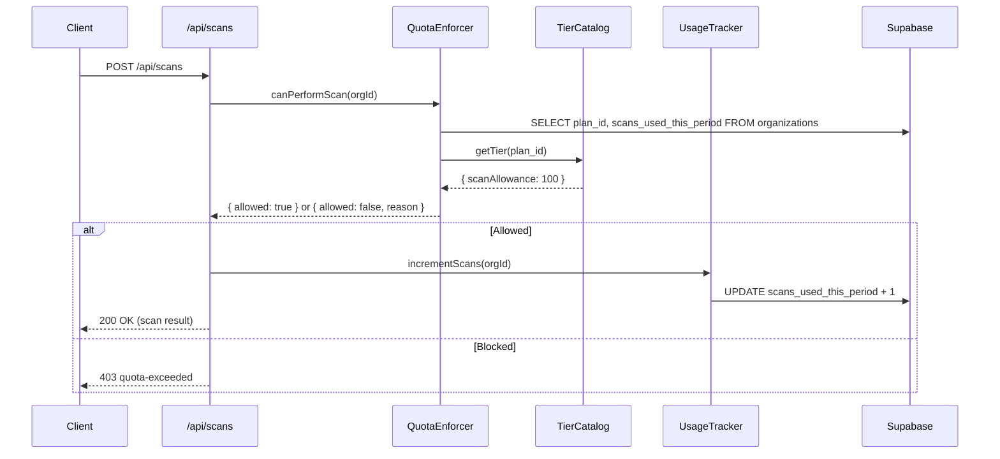

# Design Document: Pricing Tiers

## Overview

This design implements a 5-tier subscription model (Free, Developer, Team, Startup, Enterprise) for MCPGuardian. The system provides a single source of truth for tier definitions, tracks per-organization usage of scans and tool calls, enforces monthly quotas, and supports upgrade/downgrade flows via Polar.sh.

### Problem Statement

The existing codebase has tier values scattered across multiple files with conflicting numbers:
- `supabase/migrations/001_plans.sql` defines Free with 0 scans, Developer with 50, Team at $149/mo, Startup at $599/mo
- `lib/plan-limits.ts` defines Developer at $19/mo, Team at $99/mo, Startup at $399/mo with "checksPerMonth" values (2000, 20000, 200000) that don't map to the canonical scan limits
- `lib/feature-gates.ts` defines yet another set of limits (Free=0 scans, Developer=50 scans, Team=200 scans)
- The upgrade page UI shows Team with 100,000 tool calls instead of 150,000

This design reconciles all values to the canonical tier table and establishes a single TypeScript module as the authoritative source.

### Design Goals

1. **Single source of truth**: One TypeScript module (`lib/tier-catalog.ts`) defines all tier data
2. **Database alignment**: A new migration updates `001_plans.sql` values to match canonical numbers
3. **Backward compatibility**: Existing API routes and UI components continue to work via re-exports
4. **Clear separation**: Usage tracking, quota enforcement, and subscription management are distinct modules
5. **Testability**: Pure functions for quota logic enable property-based testing

## Architecture

```mermaid
graph TD
    subgraph "Tier Catalog (Single Source of Truth)"
        TC[lib/tier-catalog.ts]
    end

    subgraph "Usage Tracking"
        UT[lib/usage-tracker.ts]
        DB[(organizations table)]
    end

    subgraph "Quota Enforcement"
        QE[lib/quota-enforcer.ts]
    end

    subgraph "Subscription Management"
        SM[lib/subscription-manager.ts]
        POLAR[Polar.sh API]
    end

    subgraph "API Layer"
        SCAN[/api/scans/]
        TOOL[/api/proxy/tool-call/]
        CHECKOUT[/api/billing/create-checkout]
        WEBHOOK[/api/webhooks/polar]
        CRON[/api/cron/usage-reset]
        USAGE_API[/api/usage]
    end

    subgraph "UI"
        UP[upgrade/page.tsx]
        BILL[settings/billing/page.tsx]
    end

    TC --> QE
    TC --> SM
    TC --> UP
    TC --> BILL
    TC --> CRON

    SCAN --> QE
    TOOL --> QE
    QE --> UT
    QE --> TC

    UT --> DB
    CHECKOUT --> SM
    SM --> POLAR
    WEBHOOK --> SM
    CRON --> UT

    USAGE_API --> UT
    USAGE_API --> TC
```

### Data Flow: Scan Request



## Components and Interfaces

### 1. Tier Catalog Module (`lib/tier-catalog.ts`)

The single source of truth for all tier definitions. All other modules import from here.

```typescript
export type TierId = 'free' | 'developer' | 'team' | 'startup' | 'enterprise';
export type BillingCycle = 'monthly' | 'annual';

export interface TierDefinition {
  id: TierId;
  displayName: string;
  monthlyPriceCents: number;       // 0 for Free, -1 for Enterprise (custom)
  annualPricePerMonthCents: number; // 0 for Free, -1 for Enterprise
  scanAllowance: number | null;     // null = unlimited (Enterprise)
  toolCallAllowance: number | null; // null = unlimited (Enterprise)
  seatLimit: number | null;         // null = unlimited
  mcpServerLimit: number | null;    // null = unlimited
}

export const TIER_CATALOG: Record<TierId, TierDefinition> = {
  free: {
    id: 'free',
    displayName: 'Free',
    monthlyPriceCents: 0,
    annualPricePerMonthCents: 0,
    scanAllowance: 50,
    toolCallAllowance: 5_000,
    seatLimit: 1,
    mcpServerLimit: 1,
  },
  developer: {
    id: 'developer',
    displayName: 'Developer',
    monthlyPriceCents: 2_900,
    annualPricePerMonthCents: 2_400,
    scanAllowance: 100,
    toolCallAllowance: 25_000,
    seatLimit: 3,
    mcpServerLimit: 5,
  },
  team: {
    id: 'team',
    displayName: 'Team',
    monthlyPriceCents: 9_900,
    annualPricePerMonthCents: 8_200,
    scanAllowance: 500,
    toolCallAllowance: 150_000,
    seatLimit: 10,
    mcpServerLimit: 25,
  },
  startup: {
    id: 'startup',
    displayName: 'Startup',
    monthlyPriceCents: 29_900,
    annualPricePerMonthCents: 24_800,
    scanAllowance: 2_000,
    toolCallAllowance: 500_000,
    seatLimit: null,
    mcpServerLimit: 100,
  },
  enterprise: {
    id: 'enterprise',
    displayName: 'Enterprise',
    monthlyPriceCents: -1,
    annualPricePerMonthCents: -1,
    scanAllowance: null,
    toolCallAllowance: null,
    seatLimit: null,
    mcpServerLimit: null,
  },
};

export const VALID_TIER_IDS: TierId[] = ['free', 'developer', 'team', 'startup', 'enterprise'];

export function getTier(id: string): TierDefinition | undefined {
  return TIER_CATALOG[id as TierId];
}

export function getTierOrThrow(id: string): TierDefinition {
  const tier = getTier(id);
  if (!tier) throw new Error(`Unknown tier: ${id}`);
  return tier;
}

export function isUnlimited(allowance: number | null): boolean {
  return allowance === null;
}

export function getAnnualTotalCents(tier: TierDefinition): number {
  if (tier.annualPricePerMonthCents <= 0) return tier.annualPricePerMonthCents;
  return tier.annualPricePerMonthCents * 12;
}

export function getDisplayPrice(tier: TierDefinition, cycle: BillingCycle): string {
  if (tier.monthlyPriceCents === 0) return 'Free';
  if (tier.monthlyPriceCents === -1) return 'Custom';
  const cents = cycle === 'annual' ? tier.annualPricePerMonthCents : tier.monthlyPriceCents;
  return `$${(cents / 100).toFixed(0)}`;
}
```

### 2. Usage Tracker (`lib/usage-tracker.ts`)

Server-side functions for incrementing and reading usage counters.

```typescript
import { SupabaseClient } from '@supabase/supabase-js';

export interface UsageSnapshot {
  scansUsed: number;
  toolCallsUsed: number;
  currentPeriodStart: string | null;
  currentPeriodEnd: string | null;
}

export async function getUsageSnapshot(
  supabase: SupabaseClient,
  orgId: string
): Promise<UsageSnapshot> {
  const { data } = await supabase
    .from('organizations')
    .select('scans_used_this_period, tool_calls_used_this_period, current_period_start, current_period_end')
    .eq('id', orgId)
    .single();

  return {
    scansUsed: data?.scans_used_this_period ?? 0,
    toolCallsUsed: data?.tool_calls_used_this_period ?? 0,
    currentPeriodStart: data?.current_period_start ?? null,
    currentPeriodEnd: data?.current_period_end ?? null,
  };
}

export async function incrementScans(
  supabase: SupabaseClient,
  orgId: string
): Promise<void> {
  await supabase.rpc('increment_scans', { org_id: orgId });
}

export async function incrementToolCalls(
  supabase: SupabaseClient,
  orgId: string
): Promise<void> {
  await supabase.rpc('increment_tool_calls', { org_id: orgId });
}

export async function resetUsageCounters(
  supabase: SupabaseClient,
  orgId: string,
  newPeriodStart: string,
  newPeriodEnd: string
): Promise<void> {
  await supabase
    .from('organizations')
    .update({
      scans_used_this_period: 0,
      tool_calls_used_this_period: 0,
      current_period_start: newPeriodStart,
      current_period_end: newPeriodEnd,
    })
    .eq('id', orgId);
}
```

### 3. Quota Enforcer (`lib/quota-enforcer.ts`)

Pure logic for quota decisions, plus a server-side helper that combines DB lookup with the decision.

```typescript
import { TierDefinition, getTierOrThrow, isUnlimited } from './tier-catalog';

export type QuotaType = 'scan' | 'tool_call';

export interface QuotaCheckResult {
  allowed: boolean;
  reason?: string;
  currentUsage: number;
  allowance: number | null; // null = unlimited
  tierName: string;
}

/**
 * Pure function: determines if an operation is within quota.
 * This is the core logic, testable without DB access.
 */
export function checkQuota(
  currentUsage: number,
  allowance: number | null,
  tierName: string,
  quotaType: QuotaType
): QuotaCheckResult {
  if (isUnlimited(allowance)) {
    return { allowed: true, currentUsage, allowance, tierName };
  }

  if (currentUsage < allowance!) {
    return { allowed: true, currentUsage, allowance, tierName };
  }

  const typeLabel = quotaType === 'scan' ? 'scan' : 'tool call';
  return {
    allowed: false,
    reason: `${tierName} plan ${typeLabel} quota exceeded: ${currentUsage}/${allowance} used. Upgrade for higher limits.`,
    currentUsage,
    allowance,
    tierName,
  };
}

/**
 * Server-side helper: loads org data and checks quota.
 */
export async function canPerformScan(
  supabase: SupabaseClient,
  orgId: string
): Promise<QuotaCheckResult> {
  const { data: org } = await supabase
    .from('organizations')
    .select('plan_id, scans_used_this_period')
    .eq('id', orgId)
    .single();

  const tier = getTierOrThrow(org?.plan_id ?? 'free');
  return checkQuota(
    org?.scans_used_this_period ?? 0,
    tier.scanAllowance,
    tier.displayName,
    'scan'
  );
}

export async function canPerformToolCall(
  supabase: SupabaseClient,
  orgId: string
): Promise<QuotaCheckResult> {
  const { data: org } = await supabase
    .from('organizations')
    .select('plan_id, tool_calls_used_this_period')
    .eq('id', orgId)
    .single();

  const tier = getTierOrThrow(org?.plan_id ?? 'free');
  return checkQuota(
    org?.tool_calls_used_this_period ?? 0,
    tier.toolCallAllowance,
    tier.displayName,
    'tool_call'
  );
}
```

### 4. Subscription Manager (`lib/subscription-manager.ts`)

Handles upgrade/downgrade flows and billing cycle management via Polar.sh.

```typescript
import { TierId, BillingCycle, TIER_CATALOG, VALID_TIER_IDS } from './tier-catalog';
import { createPolarCheckout, createPolarCustomerPortal } from './polar-checkout';

export interface CheckoutRequest {
  orgId: string;
  targetTierId: TierId;
  billingCycle: BillingCycle;
  userEmail: string;
  userId: string;
  successUrl: string;
}

export interface CheckoutResult {
  checkoutUrl?: string;
  contactSales?: boolean;
  error?: string;
}

export function validateBillingCycle(value: unknown): value is BillingCycle {
  return value === 'monthly' || value === 'annual';
}

export function isUpgrade(currentTier: TierId, targetTier: TierId): boolean {
  const order = VALID_TIER_IDS;
  return order.indexOf(targetTier) > order.indexOf(currentTier);
}

export function isDowngrade(currentTier: TierId, targetTier: TierId): boolean {
  const order = VALID_TIER_IDS;
  return order.indexOf(targetTier) < order.indexOf(currentTier);
}

export async function createCheckoutSession(
  request: CheckoutRequest,
  supabase: SupabaseClient
): Promise<CheckoutResult> {
  if (request.targetTierId === 'enterprise') {
    return { contactSales: true };
  }

  if (!validateBillingCycle(request.billingCycle)) {
    return { error: 'Invalid billing cycle. Must be "monthly" or "annual".' };
  }

  // Look up Polar price ID from plans table
  const { data: plan } = await supabase
    .from('plans')
    .select('polar_monthly_price_id, polar_annual_price_id')
    .eq('id', request.targetTierId)
    .single();

  const priceId = request.billingCycle === 'annual'
    ? plan?.polar_annual_price_id
    : plan?.polar_monthly_price_id;

  if (!priceId) {
    return { error: `No Polar price configured for ${request.targetTierId} (${request.billingCycle}).` };
  }

  try {
    const url = await createPolarCheckout({
      priceId,
      customerEmail: request.userEmail,
      organizationId: request.orgId,
      successUrl: request.successUrl,
      metadata: { user_id: request.userId },
    });
    return { checkoutUrl: url };
  } catch {
    return { error: 'Checkout unavailable. Please try again.' };
  }
}
```

### 5. Database Migration (`supabase/migrations/XXX_reconcile_tier_values.sql`)

Updates the plans table to match canonical values.

```sql
-- Migration: Reconcile tier values to canonical pricing
-- Fixes inconsistencies between 001_plans.sql and the requirements spec.

UPDATE plans SET
  monthly_price_cents = 0,
  annual_price_cents = 0,
  scan_limit = 50,
  tool_call_limit = 5000,
  seat_limit = 1,
  mcp_server_limit = 1
WHERE id = 'free';

UPDATE plans SET
  monthly_price_cents = 2900,
  annual_price_cents = 28800,  -- $24/mo × 12
  scan_limit = 100,
  tool_call_limit = 25000,
  seat_limit = 3,
  mcp_server_limit = 5
WHERE id = 'developer';

UPDATE plans SET
  monthly_price_cents = 9900,
  annual_price_cents = 98400,  -- $82/mo × 12
  scan_limit = 500,
  tool_call_limit = 150000,
  seat_limit = 10,
  mcp_server_limit = 25
WHERE id = 'team';

UPDATE plans SET
  monthly_price_cents = 29900,
  annual_price_cents = 297600, -- $248/mo × 12
  scan_limit = 2000,
  tool_call_limit = 500000,
  seat_limit = NULL,  -- unlimited
  mcp_server_limit = 100
WHERE id = 'startup';

UPDATE plans SET
  monthly_price_cents = -1,     -- custom
  annual_price_cents = NULL,
  scan_limit = NULL,            -- unlimited
  tool_call_limit = NULL,       -- unlimited
  seat_limit = NULL,
  mcp_server_limit = NULL
WHERE id = 'enterprise';

-- Add RPC functions for atomic counter increments
CREATE OR REPLACE FUNCTION increment_scans(org_id UUID)
RETURNS void AS $$
BEGIN
  UPDATE organizations
  SET scans_used_this_period = scans_used_this_period + 1,
      updated_at = NOW()
  WHERE id = org_id;
END;
$$ LANGUAGE plpgsql SECURITY DEFINER;

CREATE OR REPLACE FUNCTION increment_tool_calls(org_id UUID)
RETURNS void AS $$
BEGIN
  UPDATE organizations
  SET tool_calls_used_this_period = tool_calls_used_this_period + 1,
      updated_at = NOW()
  WHERE id = org_id;
END;
$$ LANGUAGE plpgsql SECURITY DEFINER;
```

### 6. Webhook Handler Updates

The existing `/api/webhooks/polar` route already handles `subscription.created`, `subscription.updated`, `subscription.canceled`, and `subscription.revoked`. The design adds:

- **Downgrade scheduling**: On `subscription.updated` where the new plan is lower, set a `pending_plan_id` field and apply at next period start.
- **Period reset on renewal**: When `subscription.updated` includes a new `current_period_start`, reset usage counters.

### 7. Cron Job Updates (`/api/cron/usage-reset`)

The existing cron already finds orgs whose `current_period_end < NOW()` and resets counters. Updates:
- Import tier data from `lib/tier-catalog.ts` instead of `PLAN_GATES`
- Apply pending downgrades when a new period begins
- Use `tier.scanAllowance` / `tier.toolCallAllowance` for overage calculation

### 8. UI Components

**Upgrade Page** (`app/(app)/upgrade/page.tsx`):
- Replace hardcoded `PLANS` array with imports from `lib/tier-catalog.ts`
- Derive pricing display from `getDisplayPrice(tier, cycle)`

**Billing Settings** (`app/(app)/settings/billing/page.tsx`):
- Replace local `teamLimits` object with imports from `lib/tier-catalog.ts`
- Show 80% warning banners when approaching quota

**Usage Meter Component** (new: `components/billing/usage-meter.tsx`):
- Reusable progress bar component that shows scans or tool calls used/allowed
- Color changes at 80% (amber) and 100% (red)
- Shows "Unlimited" label for Enterprise

## Data Models

### Organization (existing table, no schema changes needed)

| Column | Type | Description |
|--------|------|-------------|
| id | UUID | Primary key |
| plan_id | TEXT | FK to plans.id |
| billing_cycle | TEXT | 'monthly' or 'annual' |
| scans_used_this_period | INTEGER | Current period scan count |
| tool_calls_used_this_period | INTEGER | Current period tool call count |
| current_period_start | TIMESTAMPTZ | Period start date |
| current_period_end | TIMESTAMPTZ | Period end date |
| polar_customer_id | TEXT | Polar customer identifier |
| polar_subscription_id | TEXT | Polar subscription identifier |
| subscription_status | TEXT | active, past_due, canceled |

### Plans (existing table, values updated by migration)

| Column | Type | Canonical Values |
|--------|------|-----------------|
| id | TEXT PK | free, developer, team, startup, enterprise |
| monthly_price_cents | INTEGER | 0, 2900, 9900, 29900, -1 |
| annual_price_cents | INTEGER | 0, 28800, 98400, 297600, NULL |
| scan_limit | INTEGER NULL | 50, 100, 500, 2000, NULL |
| tool_call_limit | INTEGER NULL | 5000, 25000, 150000, 500000, NULL |
| seat_limit | INTEGER NULL | 1, 3, 10, NULL, NULL |
| mcp_server_limit | INTEGER NULL | 1, 5, 25, 100, NULL |

### Pending Downgrade (new column on organizations)

| Column | Type | Description |
|--------|------|-------------|
| pending_plan_id | TEXT NULL | Plan to switch to at next period start |
| pending_plan_effective_at | TIMESTAMPTZ NULL | When the downgrade takes effect |

### Reconciliation Summary

| Source | Current Value | Canonical Value | Action |
|--------|--------------|-----------------|--------|
| 001_plans.sql: free.scan_limit | 0 | 50 | Update via migration |
| 001_plans.sql: developer.monthly_price_cents | 2900 | 2900 | ✓ Correct |
| 001_plans.sql: developer.scan_limit | 50 | 100 | Update via migration |
| 001_plans.sql: team.monthly_price_cents | 14900 | 9900 | Update via migration |
| 001_plans.sql: team.scan_limit | 200 | 500 | Update via migration |
| 001_plans.sql: startup.monthly_price_cents | 59900 | 29900 | Update via migration |
| 001_plans.sql: startup.scan_limit | 1000 | 2000 | Update via migration |
| 001_plans.sql: enterprise.monthly_price_cents | 250000 | -1 (custom) | Update via migration |
| lib/plan-limits.ts: PLAN_PRICES.developer.monthly | 19 | 29 | Replaced by tier-catalog |
| lib/plan-limits.ts: PLAN_PRICES.startup.monthly | 399 | 299 | Replaced by tier-catalog |
| lib/plan-limits.ts: PLAN_GATES.free.checksPerMonth | 100 | N/A (legacy) | Deprecate, use tier-catalog |
| lib/feature-gates.ts: PLAN_LIMITS.free.scans | 0 | 50 | Replaced by tier-catalog |
| lib/feature-gates.ts: PLAN_LIMITS.developer.scans | 50 | 100 | Replaced by tier-catalog |
| lib/feature-gates.ts: PLAN_LIMITS.team.scans | 200 | 500 | Replaced by tier-catalog |
| upgrade page: Team toolCalls | 100,000 | 150,000 | Import from tier-catalog |


## Correctness Properties

*A property is a characteristic or behavior that should hold true across all valid executions of a system — essentially, a formal statement about what the system should do. Properties serve as the bridge between human-readable specifications and machine-verifiable correctness guarantees.*

The following properties were derived from the acceptance-criteria prework. Property reflection consolidated the near-duplicate scan/tool-call criteria: quota enforcement (Req 7.1–7.3, 8.1–8.3, 12.2), the warning threshold (Req 9.3, 9.4), and usage tracking (Req 4.1–4.2, 5.1–5.2, 12.3) are each the same logic applied to two metrics, so each is expressed as one general property exercised against both counters rather than as separate per-metric properties.

### Property 1: Unknown tier lookup returns not-found

*For any* string identifier, `getTier` returns a tier definition when the identifier is exactly one of the five canonical ids (free, developer, team, startup, enterprise) and returns a `TIER_NOT_FOUND` error for every other identifier.

**Validates: Requirements 1.7**

### Property 2: Annual total is twelve times the monthly annual rate

*For any* paid tier with a defined per-month Annual_Discounted_Rate, the displayed annual total equals twelve times that rate.

**Validates: Requirements 2.4**

### Property 3: Billing cycle validation accepts only monthly or annual

*For any* string value, billing-cycle validation succeeds if and only if the value is exactly "monthly" or "annual"; every other value is rejected with a validation error.

**Validates: Requirements 3.2**

### Property 4: Usage tracking round-trip (increment then read)

*For any* organization and any number k of recorded events, recording k scans (or k tool calls) starting from a fresh period causes the corresponding consumed count read back from the Usage_Tracker to equal k, where an unrecorded counter is treated as zero. Each single recording increases the counter by exactly one, independent of the organization's tier or allowance.

**Validates: Requirements 4.1, 4.2, 4.3, 5.1, 5.2, 5.3, 12.3**

### Property 5: Period reset zeroes both counters

*For any* accumulated scan and tool-call counts, resetting the billing period sets both the consumed scan count and the consumed tool-call count to zero.

**Validates: Requirements 6.1**

### Property 6: Quota enforcement honors allowance boundaries and unlimited

*For any* tier and any non-negative consumed count, the Quota_Enforcer permits the operation when the tier's allowance is Unlimited or the consumed count is strictly below the allowance, and blocks it otherwise; a block result reports the tier's allowance and the tier identifier. This holds identically for the scan allowance and the tool-call allowance.

**Validates: Requirements 7.1, 7.2, 7.3, 8.1, 8.2, 8.3, 12.2**

### Property 7: Enforcement always reflects the currently assigned tier

*For any* organization state and any sequence of tier assignments, each quota decision uses the allowance of the tier currently assigned to the organization (`plan_id`), never a pending downgrade tier; changing the assigned tier changes the governing allowance for subsequent operations within the same period.

**Validates: Requirements 10.3, 11.2**

### Property 8: Unlimited allowance renders as the "Unlimited" label

*For any* metric whose allowance is Unlimited, the allowance display returns the label "Unlimited"; for any finite allowance it returns the numeric allowance.

**Validates: Requirements 9.2**

### Property 9: Warning threshold triggers at eighty percent

*For any* finite allowance and any non-negative consumed count, the upgrade-prompt warning flag is true if and only if the consumed count is at least eighty percent of the allowance; for an Unlimited allowance the warning flag is always false. This holds identically for scans and tool calls.

**Validates: Requirements 9.3, 9.4**

### Property 10: Subscription routing partitions by tier

*For any* tier identifier, starting a subscription routes Enterprise to the contact-sales path and routes a paid non-Enterprise tier to a self-serve checkout.

**Validates: Requirements 12.1, 10.1**

### Property 11: Downgrade is deferred and applied at the next period

*For any* current tier and any selected lower tier, scheduling a downgrade leaves the active `plan_id` unchanged and records the selection as pending; when the next billing period begins, the active tier becomes the pending tier and the pending marker is cleared. If no downgrade is pending, the active tier is unchanged across the rollover.

**Validates: Requirements 11.1, 11.4**

## Error Handling

| Condition | Handling | Requirement |
|-----------|----------|-------------|
| Lookup of an unknown tier id | `getTier` returns `{ error: "TIER_NOT_FOUND" }`; API surfaces 404 | 1.7 |
| Invalid `billing_cycle` submitted | `setBillingCycle`/`startSubscription` reject with `VALIDATION_ERROR` (400); no write performed | 3.2 |
| Scan requested at/over allowance | `checkScanQuota` returns block; route responds 429 `SCAN_LIMIT_REACHED` identifying allowance and tier | 7.2 |
| Tool call requested at/over allowance | `checkToolCallQuota` returns block; route responds 429 `TOOL_CALL_LIMIT_REACHED` identifying allowance and tier | 8.2 |
| Polar checkout session cannot be created | `startSubscription` returns `{ kind: "error", code: "CHECKOUT_UNAVAILABLE" }`; org `plan_id` left unchanged | 10.4 |
| Webhook for unknown/invalid subscription | Logged and ignored; no tier change applied | 10.2 |
| Downgrade target allowance below current usage | Accepted as pending (next period) with a notice flag; not an error | 11.3 |
| Unrecorded usage counter (NULL/absent) | Normalized to 0 via `COALESCE` in RPC and `normalizeAllowance` in code | 4.3, 5.3 |

All API responses use the existing `ok`/`err` envelope from `lib/api-helpers.ts`. Quota-exceeded responses include the allowance and current tier so the client can render an accurate upgrade prompt.

## Testing Strategy

### Dual approach

- **Unit tests** cover the fixed catalog values (Req 1.1–1.6, 2.1–2.3, 2.5–2.6, 3.3), specific UI rendering (Req 9.1), and the downgrade-notice example (Req 11.3).
- **Property-based tests** cover the universal properties above (catalog lookup, price computation, validation, usage round-trip, reset, quota enforcement, threshold, routing, downgrade rollover).
- **Integration tests** cover the external Polar.sh boundary (Req 10.1, 10.2, 10.4) and DB round-trips (Req 3.1, 6.2) using a mocked Polar client and a test Supabase schema.

### Property-based testing

PBT is appropriate for this feature because the tier catalog, price computation, quota comparison, warning threshold, and usage-increment logic are pure functions with large input spaces (arbitrary counts, allowances, strings, and tier combinations) where input variation reveals boundary bugs (e.g. used == allowance, exactly 80%, Unlimited sentinel).

- **Library:** `fast-check` with the existing Vitest test runner (TypeScript/Next.js project).
- Do **not** implement property testing from scratch.
- Each property test runs a **minimum of 100 iterations**.
- Each property test is tagged with a comment referencing its design property using the format:
  `// Feature: pricing-tiers, Property {number}: {property_text}`
- Each of the 11 correctness properties is implemented by a **single** property-based test.
- Generators must include the unrecorded-counter state (NULL/absent → 0) and boundary values (used == allowance, used == 80% of allowance) per the edge-case prework (Req 4.3, 5.3).
- Pure logic in `lib/tier-catalog.ts` is tested directly; I/O wrappers (`usage-tracker.ts`, `subscription-manager.ts`) are tested against an in-memory store for the increment/reset/rollover properties so 100+ iterations stay cheap.

### What is NOT property-tested

- Polar.sh session creation and webhook delivery (external service) — integration tests with 1–3 examples and a mocked client.
- Billing-page layout and visual presentation (Req 9.1) — component/snapshot tests.
- The fixed catalog/price constants (Req 1.1–1.6, 2.1–2.3) — example assertions, since these values do not vary with input.


## Correctness Properties

*A property is a characteristic or behavior that should hold true across all valid executions of a system — essentially, a formal statement about what the system should do. Properties serve as the bridge between human-readable specifications and machine-verifiable correctness guarantees.*

### Property 1: Tier Catalog Completeness

*For any* query to the tier catalog, the set of defined tier IDs shall be exactly `{free, developer, team, startup, enterprise}` — no more, no fewer.

**Validates: Requirements 1.1**

### Property 2: Invalid Tier Lookup

*For any* string that is not one of `{free, developer, team, startup, enterprise}`, calling `getTier(id)` shall return `undefined`.

**Validates: Requirements 1.7**

### Property 3: Annual Total Computation

*For any* paid tier (where `annualPricePerMonthCents > 0`), `getAnnualTotalCents(tier)` shall equal `tier.annualPricePerMonthCents * 12`.

**Validates: Requirements 2.4**

### Property 4: Invalid Billing Cycle Rejection

*For any* string that is not `"monthly"` or `"annual"`, `validateBillingCycle(value)` shall return `false`.

**Validates: Requirements 3.2**

### Property 5: Counter Increment

*For any* non-negative integer `n` representing a current usage count, after one increment operation the resulting count shall be `n + 1`.

**Validates: Requirements 4.1, 5.1**

### Property 6: Period Reset Zeroes Counters

*For any* organization with scan count `s >= 0` and tool-call count `t >= 0`, after a period reset both counters shall be `0`.

**Validates: Requirements 6.1**

### Property 7: Quota Decision Correctness

*For any* non-negative integer `currentUsage` and any allowance value (either a positive integer or `null` representing unlimited), `checkQuota(currentUsage, allowance, tierName, quotaType)` shall return `allowed: true` if and only if the allowance is `null` OR `currentUsage < allowance`.

**Validates: Requirements 7.1, 7.2, 7.3, 8.1, 8.2, 8.3, 12.2**

### Property 8: Warning Threshold at 80%

*For any* positive allowance `a` and non-negative usage count `n`, the system shall flag a warning if and only if `n >= 0.8 * a`.

**Validates: Requirements 9.3, 9.4**

### Property 9: Upgrade Applies New Allowances Immediately

*For any* tier upgrade from a lower tier to a higher tier, subsequent quota checks within the same billing period shall use the new (higher) tier's scan and tool-call allowances.

**Validates: Requirements 10.3**

### Property 10: Pending Downgrade Preserves Current Allowances

*For any* organization with a pending downgrade, quota enforcement shall use the current (active) tier's allowances until the new billing period begins — not the pending lower tier's allowances.

**Validates: Requirements 11.2**

## Error Handling

### Tier Lookup Errors

| Scenario | Behavior |
|----------|----------|
| Unknown tier ID queried | Return `undefined` (or throw in `getTierOrThrow`) |
| Null/undefined plan_id on organization | Default to `'free'` tier |

### Quota Enforcement Errors

| Scenario | Response |
|----------|----------|
| Scan quota exceeded | 403 `{ error: "quota_exceeded", type: "scan", used: N, limit: M, tier: "..." }` |
| Tool call quota exceeded | 403 `{ error: "quota_exceeded", type: "tool_call", used: N, limit: M, tier: "..." }` |
| Organization not found during quota check | 404 `{ error: "organization_not_found" }` |

### Billing / Checkout Errors

| Scenario | Behavior |
|----------|----------|
| Invalid billing cycle value submitted | 400 validation error |
| Polar.sh checkout API unavailable | 500 `{ error: "Checkout unavailable. Please try again." }`, org unchanged |
| No Polar price ID configured for plan | 500 `{ error: "No Polar price configured for {plan} ({cycle})." }` |
| Enterprise tier selected for checkout | Redirect to contact-sales (not an error) |

### Webhook Processing Errors

| Scenario | Behavior |
|----------|----------|
| Invalid webhook signature | 403 `{ error: "Invalid webhook signature" }` |
| Cannot resolve organization from event | Log warning, return 200 (idempotent) |
| Unknown price ID in subscription event | Log warning, return 200 (no-op) |
| Database update fails | 500, logged for manual retry |

### Usage Reset Cron Errors

| Scenario | Behavior |
|----------|----------|
| Missing CRON_SECRET header | 401 Unauthorized |
| Individual org reset fails | Log error, continue with remaining orgs |
| Polar overage reporting fails | Best-effort (logged), reset still proceeds |

## Testing Strategy

### Property-Based Tests (Vitest + fast-check)

Property-based testing is highly applicable to this feature because the core quota enforcement, tier catalog, and usage logic consists of pure functions with clear input/output behavior and large input spaces.

**Library**: `fast-check` (already in devDependencies)
**Runner**: `vitest` (already configured)
**Minimum iterations**: 100 per property

Each property test will be tagged with a comment referencing the design property:

```typescript
// Feature: pricing-tiers, Property 7: Quota Decision Correctness
```

**Properties to implement as PBT:**

| Property | Test File | Generator Strategy |
|----------|-----------|-------------------|
| P1: Catalog completeness | `tests/unit/tier-catalog.property.test.ts` | Static assertion (no generation needed) |
| P2: Invalid tier lookup | `tests/unit/tier-catalog.property.test.ts` | `fc.string()` filtered to exclude valid IDs |
| P3: Annual total computation | `tests/unit/tier-catalog.property.test.ts` | Iterate paid tiers (small finite set) |
| P4: Invalid billing cycle | `tests/unit/subscription-manager.property.test.ts` | `fc.string()` filtered to exclude "monthly"/"annual" |
| P5: Counter increment | `tests/unit/usage-tracker.property.test.ts` | `fc.nat()` for starting count |
| P6: Period reset | `tests/unit/usage-tracker.property.test.ts` | `fc.nat()` for scan count, `fc.nat()` for tool call count |
| P7: Quota decision | `tests/unit/quota-enforcer.property.test.ts` | `fc.nat()` for usage, `fc.option(fc.nat({min:1}))` for allowance |
| P8: Warning threshold | `tests/unit/quota-enforcer.property.test.ts` | `fc.nat({min:1})` for allowance, `fc.nat()` for usage |
| P9: Upgrade applies new allowances | `tests/unit/quota-enforcer.property.test.ts` | Generate tier pairs where target > current |
| P10: Pending downgrade preserves | `tests/unit/quota-enforcer.property.test.ts` | Generate (currentTier, pendingLowerTier, usage) tuples |

### Unit Tests (Vitest)

Example-based tests for concrete acceptance criteria:

- **Tier catalog values**: Assert each tier's exact price, scan/tool-call allowances (Req 1.2–1.6, 2.1–2.3, 2.5–2.6)
- **Default billing cycle**: Verify "monthly" default (Req 3.3)
- **Null/undefined usage defaults to 0** (Req 4.3, 5.3)
- **Enterprise routes to contact-sales** (Req 12.1)
- **Checkout error leaves tier unchanged** (Req 10.4)
- **Downgrade acceptance with usage > new allowance** (Req 11.3)

### Integration Tests

- **Webhook handling**: Simulate Polar subscription events, verify DB state changes (Req 10.2, 11.4)
- **Cron job**: Verify expired periods trigger reset and pending downgrades apply (Req 6.1, 6.2, 11.4)
- **Checkout API route**: Mock Polar SDK, verify checkout URL generation (Req 10.1)
- **Usage API route**: Verify correct usage data returned for each tier

### Test File Structure

```
tests/
├── unit/
│   ├── tier-catalog.property.test.ts    (P1, P2, P3 + examples)
│   ├── quota-enforcer.property.test.ts  (P7, P8, P9, P10)
│   ├── usage-tracker.property.test.ts   (P5, P6)
│   └── subscription-manager.property.test.ts (P4 + examples)
└── integration/
    ├── webhook-polar.test.ts
    ├── cron-usage-reset.test.ts
    └── billing-checkout.test.ts
```
