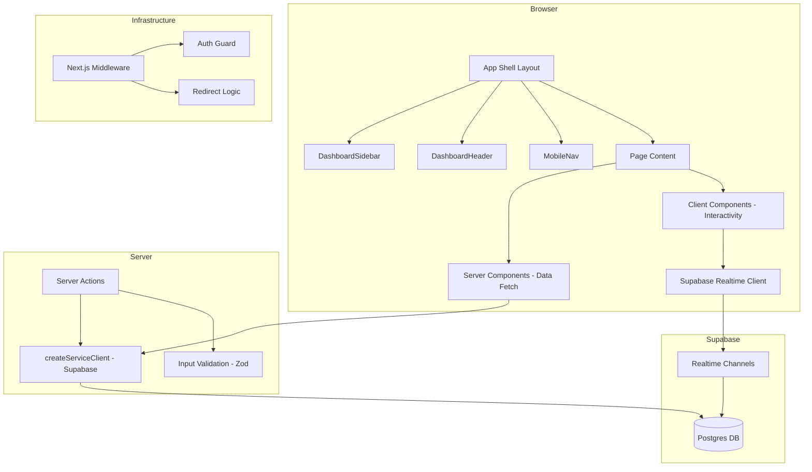

# Design Document: UI Launch Readiness

## Overview

This design document describes the architecture, components, data flow, and implementation approach for making MCPGuardian production-ready across all five pillars: end-to-end component integration, UI consistency and polish, layout and navigation, data flow verification, and launch readiness.

The existing codebase uses Next.js 15 App Router with server components for data fetching, Supabase service-role clients (`createServiceClient`) for database queries, server actions (`"use server"`) for mutations, shadcn/ui + Tailwind CSS for presentation, and CSS custom properties (`--secure`, `--threat`, `--caution`, `--monitor`, `--bg-surface`, `--bg-void`, `--bg-elevated`) for semantic theming. This design extends those established patterns to fill gaps in data wiring, loading/error/empty states, navigation, real-time subscriptions, and production concerns.

---

## Architecture

### High-Level Architecture



### Data Flow Pattern

Every page follows the same data flow pattern:

1. **Route hit** → Next.js renders `loading.tsx` (skeleton) immediately
2. **Server component** → `createServiceClient()` queries Supabase with org scoping
3. **Data resolved** → Server component renders with real data, replacing skeleton
4. **Mutations** → Client invokes server action → validates with Zod → mutates via service client → returns `ActionState`
5. **Real-time** → Client subscribes to Supabase Realtime channels for alerts/scan updates

### Key Architectural Decisions

| Decision | Rationale |
|----------|-----------|
| Server components for all data fetching | Keeps secrets server-side, leverages streaming SSR |
| Service-role client (`createServiceClient`) for queries | Bypasses RLS for admin-scoped reads within server context |
| Zod for server action validation | Consistent, type-safe validation with structured error messages |
| Supabase Realtime for live updates | Already in the stack, native channel-based subscription model |
| `loading.tsx` + `error.tsx` at every route segment | Next.js convention for streaming UIs and graceful degradation |
| CSS custom properties for semantic colors | Theme-wide consistency, easy dark-mode, token auditability |

---

## Components and Interfaces

### Pillar 1: Shared Data Access Layer

```typescript
// lib/data/org-context.ts
interface OrgContext {
  userId: string;
  organizationId: string;
  role: "owner" | "admin" | "member";
  plan: string;
}

async function getOrgContext(): Promise<OrgContext | null>;
```

Each page server component calls `getOrgContext()` to resolve the authenticated user's organization, then uses `createServiceClient()` for scoped queries.

### Pillar 2: UI Primitive Components

```typescript
// components/ui/page-skeleton.tsx
interface PageSkeletonProps {
  blocks: SkeletonBlock[];  // { type: "card" | "table" | "chart" | "header"; height: string; }
}

// components/ui/error-state.tsx
interface ErrorStateProps {
  error: Error;
  reset: () => void;
}

// components/ui/empty-state.tsx
interface EmptyStateProps {
  icon: LucideIcon;
  heading: string;
  description: string;
  cta?: { label: string; href: string };
}
```

### Pillar 3: Navigation Components

```typescript
// components/dashboard/breadcrumb-nav.tsx
interface BreadcrumbSegment {
  label: string;
  href?: string;  // undefined for current page (last segment)
}

interface BreadcrumbNavProps {
  segments: BreadcrumbSegment[];
}

// components/dashboard/nav-progress-bar.tsx
// Client component using Next.js router events to animate progress
```

### Pillar 4: Real-Time Provider

```typescript
// components/providers/realtime-provider.tsx
interface RealtimeProviderProps {
  organizationId: string;
  children: React.ReactNode;
}

// Wraps children with Supabase Realtime subscriptions
// Exposes context: { alertCount, reconnecting, connectionFailed }
```

### Pillar 5: SEO & Error Pages

```typescript
// app/not-found.tsx — custom 404
// app/global-error.tsx — custom 500
// Each page exports metadata or generateMetadata
```

---

## Data Models

### Server Action Return Type (already in use)

```typescript
// lib/types/settings.ts (extend to all actions)
interface ActionState {
  success?: boolean;
  error?: string;
  fieldErrors?: Record<string, string>;
}
```

### Realtime Event Types

```typescript
interface RealtimeAlertEvent {
  type: "INSERT";
  table: "alerts";
  record: {
    id: string;
    organization_id: string;
    severity: string;
    title: string;
    read: boolean;
  };
}

interface RealtimeScanEvent {
  type: "UPDATE";
  table: "mcp_servers";
  record: {
    id: string;
    risk_score: number;
    last_scan_at: string;
  };
}
```

### Breadcrumb Resolution

```typescript
// lib/utils/navigation.ts (extend)
interface BreadcrumbConfig {
  segment: string;
  label: string;
  resolveDynamic?: (id: string) => Promise<string | null>;
}
```

### Empty State Registry

```typescript
// lib/ui/empty-states.ts
const EMPTY_STATES: Record<string, EmptyStateProps> = {
  servers: { icon: Server, heading: "No servers registered", ... },
  sessions: { icon: Activity, heading: "No sessions recorded", ... },
  activity: { icon: Radar, heading: "No threats detected", ... },
  alerts: { icon: Bell, heading: "No alerts", ... },
  telemetry: { icon: FileText, heading: "No telemetry data", ... },
  compliance: { icon: Shield, heading: "No compliance data", ... },
};
```

---

## Correctness Properties

*A property is a characteristic or behavior that should hold true across all valid executions of a system — essentially, a formal statement about what the system should do. Properties serve as the bridge between human-readable specifications and machine-verifiable correctness guarantees.*

### Property 1: Server action validation round-trip

*For any* server action input that fails Zod validation, the returned `ActionState` SHALL contain an `error` string and SHALL NOT have `success: true`, and the original form state must remain unmodified.

**Validates: Requirements 15.1, 15.3**

### Property 2: Empty state rendering consistency

*For any* data page (servers, sessions, activity, alerts, telemetry, compliance) with zero records, the rendered output SHALL contain the `EmptyState` component with the configured heading for that page.

**Validates: Requirements 9.1, 9.3, 9.4, 9.5, 9.6, 9.7, 9.8**

### Property 3: Design token semantic exclusivity

*For any* component rendering a status indicator, the CSS color value applied SHALL reference exclusively one of the four semantic tokens (`--secure`, `--threat`, `--caution`, `--monitor`) and SHALL NOT use hardcoded hex values or direct Tailwind color classes for status meaning.

**Validates: Requirements 10.1, 10.2, 10.3, 10.4, 10.6**

### Property 4: SEO metadata title format

*For any* page under `app/(app)/` or `app/(auth)/`, the exported metadata title SHALL match the pattern `"{Page Name} — MCPGuardian"` and SHALL NOT exceed 60 characters.

**Validates: Requirements 18.1, 18.2**

### Property 5: Breadcrumb trail structure

*For any* nested route (deeper than one segment under `app/(app)/`), the breadcrumb trail SHALL contain at least 2 segments, the last segment SHALL be non-clickable, and all ancestor segments SHALL have valid `href` attributes.

**Validates: Requirements 12.1, 12.2, 12.4**

### Property 6: Optimistic update rollback

*For any* optimistic update action that fails server-side, the UI state SHALL revert to its pre-action value and the user SHALL see an error toast.

**Validates: Requirements 17.2, 17.4**

### Property 7: Usage warning badge threshold

*For any* organization usage metrics, a warning badge SHALL appear if and only if the consumed count equals or exceeds 80% of the tier allowance, unless the allowance is unlimited.

**Validates: Requirements 1.5, 1.6**

### Property 8: Compliance score computation

*For any* set of NSA compliance control results (excluding "roadmap" controls), the computed compliance score SHALL equal `Math.round((passed_non_roadmap_count / total_non_roadmap_count) * 100)` and SHALL be an integer from 0 to 100 inclusive.

**Validates: Requirements 6.1**

### Property 9: CSV export column structure

*For any* set of threat log events exported to CSV, the output SHALL contain the exact column headers `id,type,title,description,severity,session_id,server_id,created_at` and each row's `created_at` SHALL be a valid ISO 8601 UTC string.

**Validates: Requirements 5.5**

### Property 10: Auth redirect determination

*For any* successful login, the redirect destination SHALL be the `redirectTo` query parameter if it starts with `/`, otherwise `/dashboard`. For any logged-in user visiting auth routes (`/login`, `/signup`, `/forgot-password`), the redirect SHALL be `/dashboard`.

**Validates: Requirements 22.1, 22.4**

---

## Error Handling

### Strategy by Layer

| Layer | Error Type | Handling |
|-------|-----------|----------|
| Server Component (data fetch) | Network/DB failure | Throw → caught by `error.tsx` Error Boundary |
| Server Action | Validation failure | Return `{ error: string }` — no throw |
| Server Action | DB/network failure | Return `{ error: string }` — no throw |
| Server Action | Unhandled exception | Throw → caught by Error Boundary (Req 15.5) |
| Realtime | Connection lost | Exponential backoff reconnect (1s, 2s, 4s, max 30s) |
| Realtime | 5 failed reconnects | Show persistent "Live updates unavailable" + manual retry |
| Dynamic import | Network failure | Show inline error with retry action (Req 20.5) |
| Auth callback | Invalid/expired link | Display error + link to `/forgot-password` |

### Error Boundary Implementation Pattern

```typescript
// app/(app)/[segment]/error.tsx
"use client";

export default function SegmentError({ error, reset }: { error: Error; reset: () => void }) {
  useEffect(() => { console.error(error); }, [error]);

  const message = error.message?.slice(0, 200) || "An unexpected error occurred";

  return (
    <div className="flex flex-col items-center justify-center p-8">
      <AlertTriangle className="size-12" style={{ color: "var(--threat)" }} />
      <p className="mt-4 text-sm text-slate-300">{message}</p>
      <div className="mt-4 flex gap-3">
        <Button onClick={reset}>Try again</Button>
        <Button variant="outline" asChild>
          <Link href="/dashboard">Go to Dashboard</Link>
        </Button>
      </div>
    </div>
  );
}
```

### Toast Notification Patterns

- **Success**: Shown within 500ms of server action completion. Green check icon.
- **Error**: Shown on server action failure. Red alert icon. Form inputs preserved.
- **Reconnecting**: Subtle indicator in sidebar (not a toast) after 5s disconnection.

---

## Testing Strategy

### Testing Approach

This feature spans UI rendering, data integration, navigation, and accessibility — areas where property-based testing provides value for validation logic and data transformations, while example-based tests cover component rendering and integration.

**Unit Tests (example-based)**:
- Component rendering: verify loading skeletons, error states, empty states render correctly
- Server actions: verify validation rejects bad input, returns structured errors
- Navigation: verify breadcrumb resolution for known routes
- Accessibility: verify ARIA attributes on key components
- Design tokens: verify components use CSS custom properties

**Property Tests (fast-check, 100+ iterations)**:
- Server action validation: generate random invalid inputs → always returns error, never success
- SEO metadata: generate page names → title always ≤ 60 chars, matches format
- Compliance score: generate random control arrays → score always 0–100, matches formula
- Usage threshold: generate random usage/allowance combos → badge shows iff ≥ 80%
- CSV export: generate random event arrays → output always has correct headers, valid ISO dates
- Auth redirect: generate random `redirectTo` values → redirect is always deterministic

**Integration Tests**:
- Full page render with mocked Supabase → data displays correctly
- Server action + database round-trip with test fixtures
- Real-time subscription → alert badge increments

**Configuration**:
- Test framework: Vitest (already configured)
- PBT library: fast-check (already in devDependencies)
- Each property test runs minimum 100 iterations
- Tag format: `Feature: ui-launch-readiness, Property {N}: {description}`

### Test File Organization

```
lib/__tests__/
  server-action-validation.property.test.ts  (Property 1)
  empty-state-registry.test.ts               (Property 2)
  design-token-audit.test.ts                 (Property 3)
  seo-metadata.property.test.ts              (Property 4)
  breadcrumb-nav.test.ts                     (Property 5)
  optimistic-update.test.ts                  (Property 6)
  usage-threshold.property.test.ts           (Property 7)
  compliance-score.property.test.ts          (Property 8)
  csv-export.property.test.ts                (Property 9)
  auth-redirect.property.test.ts             (Property 10)
components/__tests__/
  error-boundary.test.tsx
  page-skeleton.test.tsx
  mobile-nav.test.tsx
  sidebar.test.tsx
```
